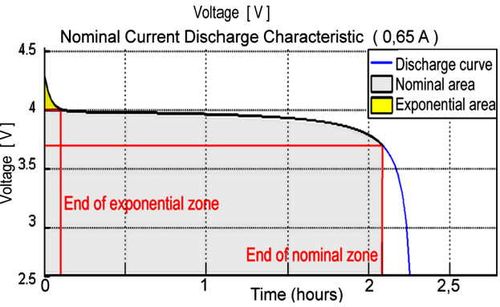
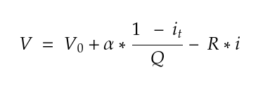
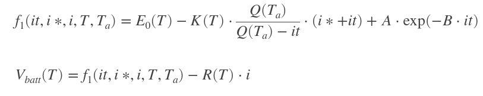
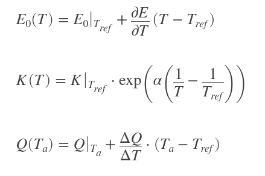
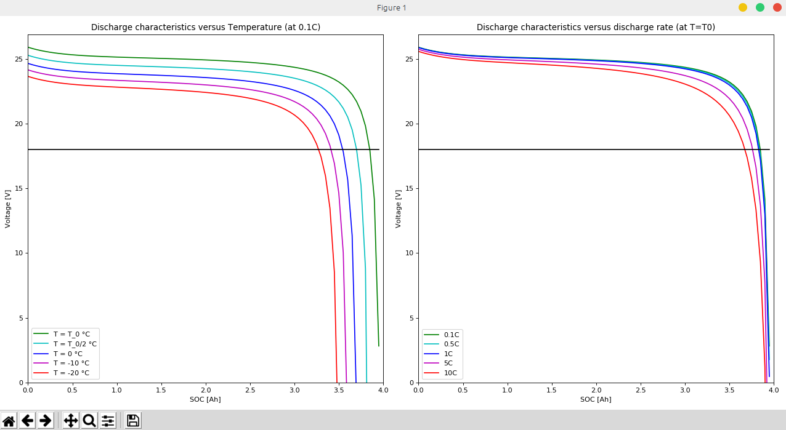

# Gazebo-ROS battery plugin

This repository contains a generic battery plugin for Gazebo to be used in ROS robot simulations. It implements two operation modes, a simple linear charge/discharge model and a parametric nonlinear dynamic discharge model. For the parameter tuning of the latter we provide a visualization tool of the discharge curves under various temperatures and current loads.

## Battery models

**Discharge characteristics** of chemical batteries is represented by the graph below. The first section - *exponential area* - shows the exponential voltage drop starting from a fully charged state. ( *The width of this section depends on the battery type.* ) The second section - *nominal area* -  represents the charge that can be extracted from the battery until the voltage drops below the battery nominal voltage. The last section shows the total discharge of the battery, when the voltage drops rapidly.




### Simple linear model

In this mode of operation the charge drops in a linear fashion respect to the current drawn from the virtual battery without taking temperature into consideration. 



Where 

* **V** is the current voltage [V], 

* **V0** is the voltage of the battery when fully charged [V],
* **α** is the linear discharge coefficient,
* **it** is the accumulated discharge [Ah],
* **Q** is the design capacity of the battery [Ah],
* **R** is the internal resistance of the battery [Ohm],
* and **i** is the current drawn. *( after processed by a low-pass filter )* [A]


### Generic dynamic model

Nonlinear dynamic discharge model is formulated as



where

* ***A*** is the exponential voltage [V],
* ***B*** is the exponential capacity [1/Ah],
* **T** is the temperature of the battery [C],
* **Ta** is the ambient temperature [C],

with the impact of temperature on the model parameters



where

* **K** is the polarization constant [V/Ah]

* **Tref** is the reference or design temperature [C],

* **α** is the Arrhenius rate constant for the polarization resistance.

  

## How to use the plugin

For convenience we have provided a `xacro` to include the nonlinear model that reads the parameters from a `yaml` file. _If you would like to use the linear model, include it as you would with any other gazebo plugin._

```xml
  <xacro:include filename="$(find gazebo_ros_battery)/xacro/battery.xacro"/>
  <xacro:battery sensor_name="battery" frame_id="battery_link" 
                 params_yaml="$(find gazebo_ros_battery)/params/G24B4.yaml"/>
```

When loaded it will publish `noetic` Battery State messages on every state update. To attach consumers to the virtual battery, just provide the number of channels *( any dynamic and static consumers )* and the plugin is going to create numbered `std_msgs::Float32` topic subscribers under the prefix of `consumer_topic`.

When the virtual battery is fully discharged, or the simulated electronic protection cuts off the voltage, you can call either the `Reset` service or the `setCharge` service to restore its charge state.

Ambient temperature can be set through the `setTemperature` service, internal temperature of the battery is then calculated to change in accordance with the `temperature_response_tau` parameter.

### Parameters

Mode of operation is chosen through the `use_nonlinear_model` parameter. *( Defaults to True )*

#### Common parameters

- `current_filter_tau` - is the coefficient for the low pass filter on the drawn current
- `temperature_response_tau` - is the coefficient for the internal battery temperature filter
- `update_rate` - is the fixed frequency of the model update function [Hz]
- `rosDebugLevel` - sets the plugin log level, debug by default
- `num_of_consumers` - number of load subscribers to instantiate
- `consumer_topic` - topic prefix of the numbered load subscribers ( `/battery/consumer/0` )
- `frame_id` - the transformation frame associated with the battery in the URDF
- `battery_topic` - battery state message topic name
- `publish_voltage` - whether to publish battery voltage as `std_msgs::Float32` alongside the status messages ( *[gazebo_ros_motors](https://github.com/nilseuropa/gazebo_ros_motors)* compatibility )
- `battery_voltage_topic` - name of the battery voltage topic if enabled

#### Linear model parameters

* `linear_discharge_coeff` - or **α **as described in the model section - is a weight that sets how much the actual charge is considered in the calculation of the discharge curve steepness.

#### Nonlinear model parameters

* `polarization_constant `- or **K** - is the polarization constant [V/Ah]
* `exponential_voltage` - or **A** - [V] is the voltage at the end of the exponential area
* `exponential_capacity` - or **B** - [1/Ah] is the capacity at the end of the exponential area
* `characteristic_time` - characteristic time [s] of **i***
* `design_temperature`- or **Tref**- Design temperature where polarization constant is unchanged
* `arrhenius_rate_polarization` - or **α** - Arrhenius rate of polarization constant [K]
* `capacity_temp_coeff` - Temperature dependence of capacity [Ah/K]
* `reversible_voltage_temp` - Linear temperature dependent voltage shift [V/K]

### Model tuning

Usually some parameters and a discharge curve is provided by battery manufacturers. In order to properly simulate the discharge of an unknown battery it is best to plot the voltage drop against a fixed current at a given temperature. Either way there has to be a plot that can be compared against the expected runoff of the model.

1. Acquire the discharge curve of the given battery.
2. Create a parameter file ( duplicate the one provided ).
3. Use the `battery_config.py` tool in the `params` folder to visualize the models curve.
4. Adjust the parameters in the `yaml` file until the fit is acceptable. 
5. Load the same parameter file with the `xacro` to run your battery simulation.

#### Model configuration script

`~/gazebo_ros_battery/params$ ./battery_config.py G24B4.yaml`




**Authors:** Marton Juhasz - [nilseuropa](https://github.com/nilseuropa), Gergely Gyebroszki - [gyebro](https://github.com/gyebro)

**Sources:** https://www.mathworks.com/help/physmod/sps/powersys/ref/battery.html

